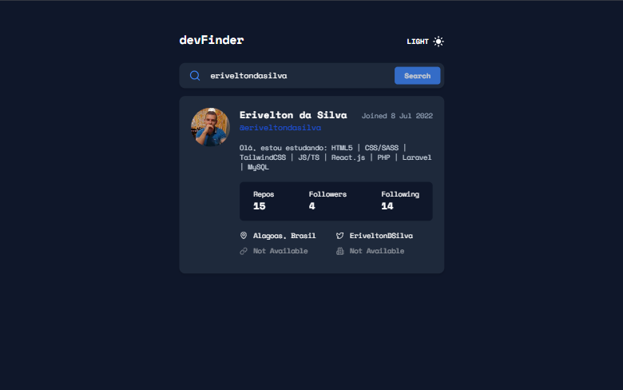
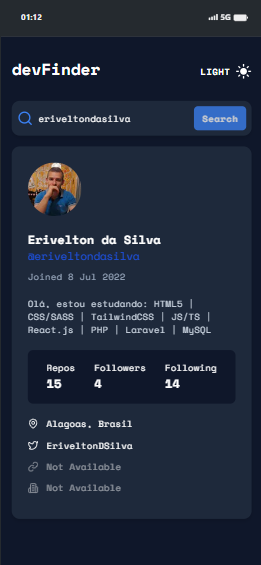

# Frontend Mentor - GitHub user search app

 

This is a solution to the [Advice generator app challenge on Frontend Mentor](https://www.frontendmentor.io). Frontend Mentor challenges help you improve your coding skills by building realistic projects.

## Table of contents

- [Overview](#overview)
  - [Screenshot](#screenshot)
  - [Links](#links)
- [My process](#my-process)
  - [Built with](#built-with)
- [Author](#author)

## Overview

### Screenshot

### Links

- Live Site URL: <https://github-user-search-app-eriveltonsilva.vercel.app>

## My process

### Built with

- Semantic HTML5 markup
- Flexbox
- Grid
- Fetch
- [lucide](https://lucide.dev/) - Beautiful & consistent icons
- [Tailwindcss](https://tailwindcss.com/)
- [tailwind-merge](https://www.npmjs.com/package/tailwind-merge) - Utility function to efficiently merge Tailwind CSS classes in JS without style conflicts.
- [next.js](https:/nextjs.org/) - js framework

## Author

- Frontend Mentor - [@eriveltondasilva](https://www.frontendmentor.io/profile/eriveltondasilva)
- Instagram - [@erivelton.dsilva](https://www.instagram.com/erivelton.dsilva/)
- Twitter - [@EriveltonDSilva](https://twitter.com/EriveltonDSilva)
